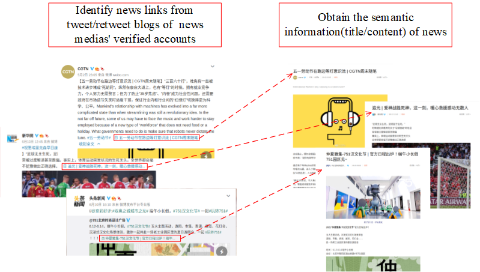
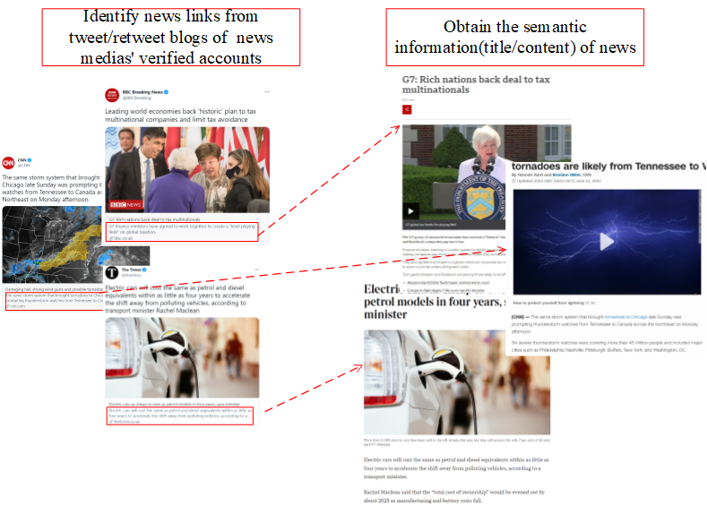

# DSN: Influence-Aware News Recommendation in Social Media
This repository is the implementation of DSN, a deep learning based model for news recommendation in social media,
which makes news recommendation not only based on the semantic information of news, but also the social impact it carries
due to the diffusion and propagation process in the social network. The main components of DSN model are:
- A special designed CNN as feature extractor to learn jointly the semantic representation and social-related representation of news.
- An attention network to aggregate user's adopted news w.r.t candidate news.

How the news is obtained from social media
---
- on weibo

- on twitter

Files description
---
- 'data/'
    - 'weibo/'
        - 'repost_data_sample.txt': repost records between users.
        - 'graph_170w_1month_sample.txt': the dynamic followership between users within one month.
        - 'total_sample.txt':diffusion of blogs between users.
    - 'weibo_formed_data_1m_history25_neg15_influence_emb.pkl': for each user with 25 positive news sampled from user hsitory and 15 negative news randomly sampled from weibo data. 
    For each pieces of news, words in the title are embedded as f-dimensional word vectors and all the users involved in its propagation process are embedded as g-dimentional node vectors.
    The final representation of news is the concatenation of title word embedding and node embedding of involved users.
    
- 'model/'
    - 'config.py': configuration of DSN to for parameter tuning.
    - 'dsn.py': the model.
    - 'main.py'
    - 'train.py'
- 'utils.py'
    - 'load_data.py': data loader.

> Note: The weibo repost data and user followership data are only a small sample of the ones carried out in experiment, the link of original weibo dataset and its detailed description are
>available in [sina weibo](https://www.aminer.org/influencelocality). And for simplicity, the node embedding (by INFECTOR) and word embedding ([weibo chinese vector](https://github.com/Embedding/Chinese-Word-Vectors))
>are generated in weibo_formed_data_1m_history25_neg15_influence_emb.pkl for direct use.

Required packages
---
- tensorflow-gpu == 2.1.0
- sklearn == 0.21.3
- pandas == 0.25.1
- Keras == 2.3.1
- gensim == 3.8.1
- graphviz == 0.14.1
- jieba == 0.42.1
- numpy == 1.17.2

